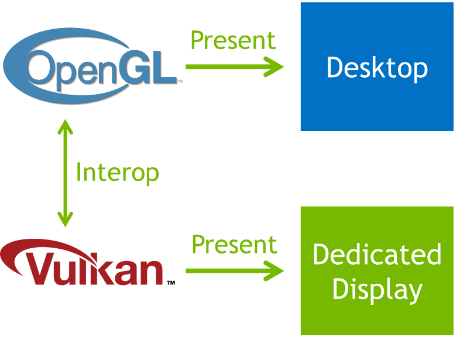

# NOTE

[https://github.com/nvpro-samples/vk_ddisplay](vk_ddisplay) is a new sample that shows an updated use of the ddisplay feature, including tools needed to configure the system, and multi-GPU and multi-display support.
This sample is left online for documentation purposes.

# OpenGL/Vulkan Direct Display Sample

This sample shows how to use the Direct Display functionality available in Windows.
A simple Vulkan renderer included in this sample uses ```VK_KHR_display``` to enumerate and initialize a display to take exclusive control over it.


The sample is geared towards developers of an existing OpenGL application that want to add Direct Display output.
Since OpenGL does not provide an extension for Direct Display, OpenGL/Vulkan interop is used to render from OpenGL into a Vulkan interop texture.
This texture is then displayed on Direct Display and simultaneously is shown on the Windows desktop through the usual OpenGL present.



### Prerequisites
Only certain editions of Windows support removing a display from the desktop, please refer to the [Microsoft documentation](https://learn.microsoft.com/en-us/windows-hardware/drivers/display/specialized-monitors) for more information.

In addition to this requirement, the NVIDIA driver implementation of this feature is only supported on Windows 11 and later, in the editions discussed in the Microsoft documentation.

To run this sample, the test system needs to have at least two displays connected, and at least one display needs to be configured as Direct Display output.

To be able to enumerate and take over a display as a Direct Display, it first needs to be taken out of the Windows desktop.
Go to Start -> Settings -> System -> Display  -> Advanced display settings.


Choose the monitor that should become the Direct Display output and toggle the "Remove display from desktop" switch to on.


That monitor will go blank and the Windows desktop will not be extended to this display anymore.

### Vulkan Direct Display
The Vulkan renderer part of the sample uses the ```VK_KHR_display``` extension to take control over a Direct Display output.
This extension is not exported by default. The display driver needs to be configured to export the extension.
The Configure Driver Utility available at [https://www.nvidia.com/en-us/drivers/driver-utility/](https://www.nvidia.com/en-us/drivers/driver-utility/) can be used to configure the driver accordingly.
Run the utility with administrator rights and choose the option "6: Export VK_KHR_display extension".

### Running The Sample
The sample creates an instance of the class ```VKDirectDisplay``` which enumerates and initializes the Direct Display output,
and creates the textures used to perform the interop with OpenGL.

The OpenGL renderer part of the sample obtains an interop texture using ```VKDirectDisplay::getTexture()```, renders into it and and submits the texture back using ```VKDirectDisplay::submitTexture()```.
The submit function blits the content onto a swapchain texture and presents it onto the Direct Display output. The inferface functions of ```VKDirectDisplay``` perform all needed synchronization between OpenGL and Vulkan, making sure that texture operations in one API have finished before the textures are used in the other API.
The OpenGL renderer also uses the rendered texture to present it on the OpenGL window. In a real-world application this behavior is optional, but can be used as a control display.

### Known Issues
It is possible that swap chain creation fails in the initialization step of the class ```VKDirectDisplay``` after the ddisplay has been in standby.
Re-starting the application after a failure should initialize successfully.

### Source Code
The relevant parts in the source code are marked with the comment ```// VK_KHR_display``` and should show the areas where Direct Display functionality is used.

### Building
Make sure to have installed the [Vulkan-SDK](http://lunarg.com/vulkan-sdk/). Always use 64-bit build configurations.

Ideally, clone this and other interesting [nvpro-samples](https://github.com/nvpro-samples) repositories into a common subdirectory. You will always need [nvpro_core](https://github.com/nvpro-samples/nvpro_core). The nvpro_core is searched either as a subdirectory of the sample, or one directory up.

If you are interested in multiple samples, you can use [build_all](https://github.com/nvpro-samples/build_all) CMAKE as entry point, it will also give you options to enable/disable individual samples when creating the solutions.

